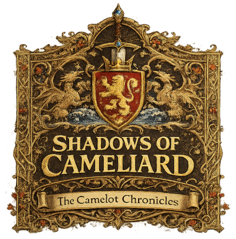
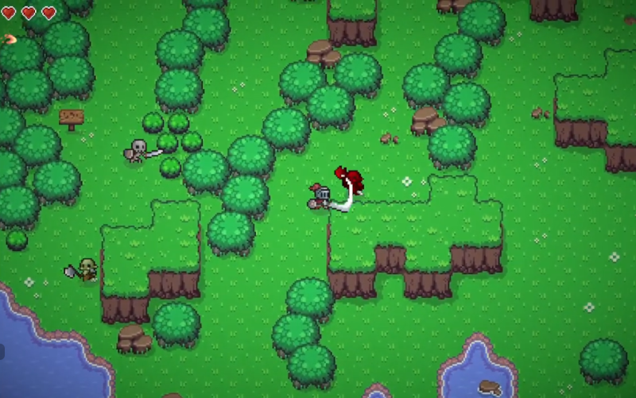
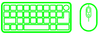

### Máster de Diseño y Programación de Videojuegos 
## Programación de Videojuegos 2D
#### Francisco Gabriel Montoiro Cabada

## **PROYECTO**

### **Shadows of Cameliard**

**Shadows of Cameliard** es un juego 2D top-down de acción/RPG desarrollado en Unity con estética pixel art ambientado en las leyendas artúricas y centrado en las aventuras del personaje principal **Lancelot del Lago**.

> Por petición expresa del Rey Arturo, Lancelot debe atravesar las tierras invadidas de Cameliard para rescatar a la reina Ginebra, cautiva tras la ofensiva de Mordred.

La demo combina exploración, combate básico, diferentes armas y una presentación narrativa mediante un códices ilustrado.

Las características del gameplay más destacables son:

- Mapas extensos. La demo abarca los correspondientes al capítulo II de la trama, los campos y cuevas en los alrededores de Cameliard.

- Inventario de items y múltiples armas. En la demo:
  - **_Steel of Benwick_**, espada
  - **_Star of Avalon_**, arco
  - **_Flame of Pendragon_**, pócima explosiva

- Catálogo de acciones: andar/correr, ataque, bloqueo y _dash_.

- Diferentes enemigos. En la demo: orcos y esqueletos

- Personajes interactuables que nos otorgarán armas u objetos. En la demo, **Merlín** y el **Capitán de la Guardia**.

- Regeneración automática de vida (cuando se está inactivo) y _cooldown_ de _dash_.

- Tras muerte, reaparición en el último punto de _spawn_ (portal)

## Vídeos

- Playlist [\[YouTube\]](https://www.youtube.com/playlist?list=PLAFHCgSddAElifsf0Zrz6eAZQc2xcIBik)

  - 🎬 Trailer [\[YouTube\]](https://youtu.be/-aZueMNefTI)

  - 🎬 Recorrido completo (⚠️¡¡SPOILER!!⚠️) [\[YouTube\]](https://youtu.be/JIvd5N5bD3U)    

## WebGL

- 🕹️ Unity Play [\[link\]](https://play.unity.com/en/games/90280348-79d1-434d-9aa4-c2d1c581c92b/shadows-of-cameliard)
    
## PC (x64)

- 🕹️ Windows [\[zip\]](builds/win/ShadowsOfCamleiard_0.1_Win.zip)

- 🕹️ Linux [\[zip\]](builds/linux/ShadowsOfCamleiard_0.1_Linux.zip)

## Controles

### **Gamepad/Virtual**

#### Personaje

- **Movimiento:** LEFT-STICK
- **Ataque:** A
- **Dash:** B
- **Bloqueo:** X
- **Abrir Inventario:** SELECT

#### Inventario

- **Siguiente:** PAD-RIGHT
- **Anterior:** PAD-LEFT
- **Seleccionar/Cerrar:** SELECT

#### UI/Mensajes

- **Cerrar:** SELCT

#### Codex

- **Siguiente/Anterior:** LEFT-STICK

### **Teclado/Ratón**

#### Personaje

- **Movimiento:** WASD
- **Ataque:** MOUSE-LEFT
- **Dash:** SPACE
- **Bloqueo:** MOUSE-RIGHT
- **Abrir Inventario:** E

#### Inventario

- **Siguiente:** D
- **Anterior:** A
- **Seleccionar/Cerrar:** E

#### UI/Mensajes

- **Cerrar:** X

#### Codex

- **Siguiente:** A
- **Anterior:** D

*(gesto invertido)

## Documentación

### Wiki Técnica

[README](docs/README.md)
