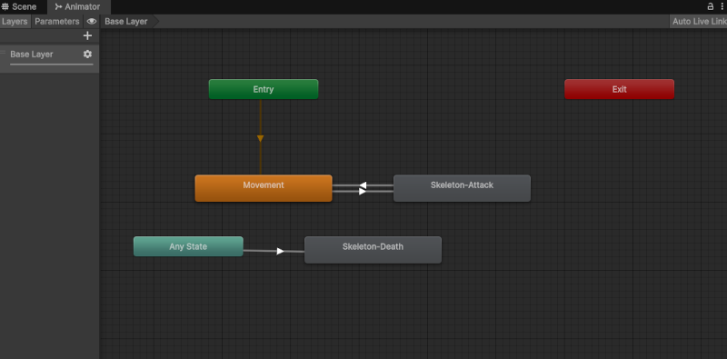

# Animaciones de enemigos

`Orc` y `Skeleton` usan una estructura de Animator equivalente.

```text
Entry → Movement
Movement ↔ Attack
Any State → Death
```

| Estado | Función |
|---|---|
| `Movement` | Animación base de movimiento/reposo. |
| `Attack` | Ataque cuerpo a cuerpo. |
| `Death` | Muerte del enemigo. |



La muerte se lanza desde `Any State`, permitiendo que el enemigo muera correctamente aunque esté caminando o atacando.

[< volver](README.md)