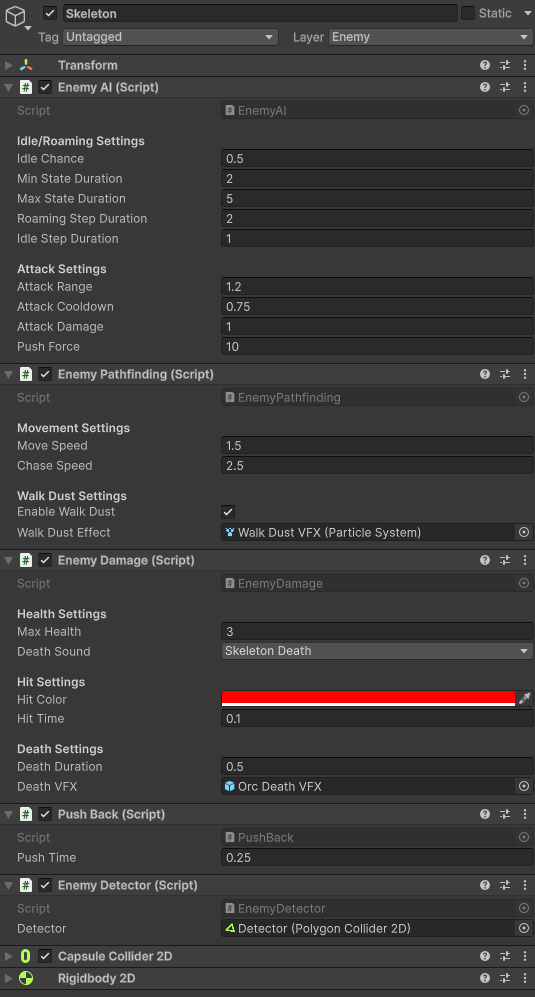

# Ataque y daño de enemigos

El ataque se configura desde `EnemyAI`.

## Salud del Skeleton

| Parámetro | Valor |
|---|---:|
| `Max Health` | `3` |
| `Death Sound` | `Skeleton Death` |
| `Hit Color` | Rojo |
| `Hit Time` | `0.1` |
| `Death Duration` | `0.5` |

El campo `Death VFX` observado apunta a `Orc Death VFX`. Puede ser una reutilización intencional del efecto o una limpieza pendiente si se quiere diferenciar cada enemigo.

[< volver](README.md)