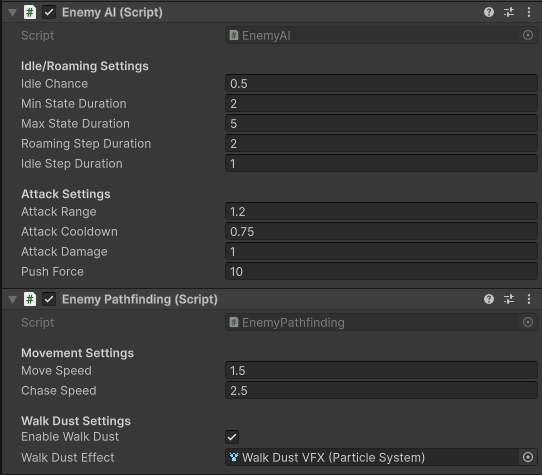

# Estados y comportamiento

Los enemigos alternan entre reposo, movimiento errante, persecución y ataque.

Su comportamiento está determinado por dos componentes: [**EnemyAI**](../../ShadowsOfCameliard/Assets/Scripts/Enemy/EnemyAI.cs) y [**EnemyPathfinding**](../../ShadowsOfCameliard/Assets/Scripts/Enemy/EnemyPathfinding.cs)

## Configuración del Skeleton 



## Flujo simplificado

```text
Idle / Roaming
      ↓
Jugador detectado
      ↓
Chasing
      ↓
Jugador en rango
      ↓
Attacking
      ↓
Vuelta a persecución o reposo
```

Esta IA es simple, pero suficiente para una demo de acción top-down.

[< volver](README.md)