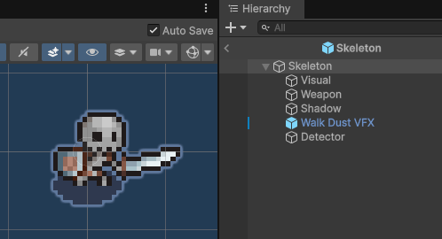

# Estructura de enemigos

`Orc` y `Skeleton` usan una jerarquía común:

```text
Enemy
├── Visual
├── Weapon
├── Shadow
├── Walk Dust VFX
└── Detector
```

| Objeto | Función |
|---|---|
| `Visual` | Sprite y Animator. |
| `Weapon` | Referencia o zona de ataque. |
| `Shadow` | Sombra bajo el enemigo. |
| `Walk Dust VFX` | Partículas al caminar. |
| `Detector` | Área de detección del jugador. |



## Componentes del objeto raíz

| Componente | Función |
|---|---|
| `EnemyAI` | Estados, roaming, persecución y ataque. |
| `EnemyPathfinding` | Movimiento normal y persecución. |
| `EnemyDamage` | Vida, daño recibido y muerte. |
| `PushBack` | Retroceso al recibir golpes. |
| `EnemyDetector` | Lectura del detector. |
| `Capsule Collider 2D` | Collider físico. |
| `Rigidbody 2D` | Movimiento por físicas 2D. |

El prefab `Skeleton` se usa como ejemplo de referencia, pero el orco comparte la misma estructura.

[< volver](README.md)