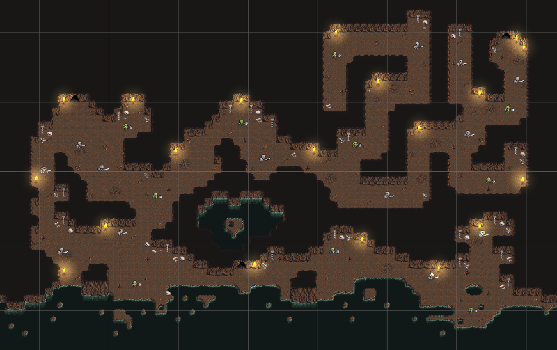

# Escena CountryCave

`CountryCave` es la zona subterránea de la demo. A diferencia de `Countryside`, es una escena más cerrada, oscura y orientada al combate.

## Jerarquía principal

```text
CountryCave
├── Setup
│   ├── CursorMode
│   ├── Global Light 2D
│   └── Cameras
│       ├── CinemachineCamera
│       ├── Main Camera
│       └── Global Volume
└── Scene
    ├── Enemies
    │   ├── Skeletons
    │   └── Orcs
    └── Map
        ├── Portals
        │   ├── Portal North
        │   ├── Portal South
        │   └── Portal East
        ├── CameraConfiner
        └── Environment
            ├── Props
            │   └── Torchs
            └── Tilemaps
                └── Grid
                    ├── Deco
                    ├── Walls
                    ├── Water
                    └── Ground
```

## Rasgos de diseño

- Pasillos excavados en roca.
- Menor amplitud que el mapa exterior.
- Antorchas como iluminación local.
- Agua subterránea como límite natural.
- Enemigos distribuidos en corredores y salas.
- Portales para conectar con salidas y la torre de la guardia de `Countryside`.




## Relación con sistemas persistentes

La escena no necesita duplicar managers globales ni al jugador. Al entrar desde `Countryside`, los sistemas persistentes continúan activos y `PortalSpawn` recoloca a Lancelot en el punto correcto.

[< volver](README.md)