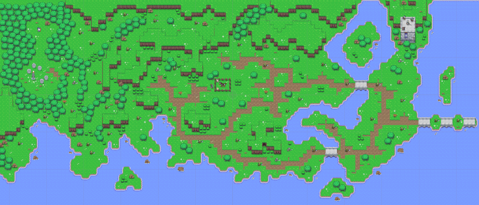
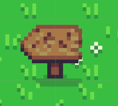

# Escena Countryside

`Countryside` es la escena jugable principal. Funciona como mapa exterior de Cameliard, contiene el inicio real de la partida y reúne la mayor parte de sistemas persistentes.

## Jerarquía principal

```text
Countryside
├── Setup
│   ├── CursorMode
│   ├── Global Volume
│   ├── Global Light 2D
│   └── Cameras
│       ├── CinemachineCamera
│       ├── Main Camera
│       └── Global Volume
├── Scene
│   ├── PortalCanvas
│   │   └── Fade_Image
│   ├── NPC
│   │   ├── Friends
│   │   │   ├── Merlin
│   │   │   └── Templar
│   │   ├── Enemies
│   │   │   ├── Orcs
│   │   │   └── Skeletons
│   │   └── Special
│   │       ├── Tower Soldier 1
│   │       ├── Tower Soldier 2
│   │       ├── ArmoredHorse
│   │       ├── Magic Tree
│   │       └── Eagle
│   └── Map
│       ├── CameraConfiner
│       └── Environment
│           ├── Portals
│           ├── Signs
│           ├── NatureProps
│           └── Tilemaps
├── Managers
├── UI
├── Lancelot
└── Welcome
```

## Zonas principales

- Bosque occidental asociado a Merlín y Broceliande Woods.
- Zona de inicio junto al caballo de Lancelot.
- Caminos de tierra que guían hacia los puntos clave.
- Lagos, ríos y mar como límites naturales no transitables.
- Torre del templario en el noreste.
- Puentes que conectan rutas separadas por agua.
- Portal final hacia el puente de Cameliard.



## Portales de la escena

```text
Portals
├── Game Start
├── Portal Tower Hatch
├── Portal Cave North
├── Portal Cave South
└── Portal Bridge
```

Cada portal contiene un `PortalExit` y un `PortalSpawn`. El `PortalExit` define la escena y el spawn de destino; el `PortalSpawn` identifica el punto de llegada dentro de `Countryside`.

## Señales

```text
Signs
├── Druids's Camp
├── Broceliande Woods
├── Cameliard Road
└── Cameliard Bridge
```



Las señales ayudan a orientar al jugador dentro del mapa exterior y refuerzan la estructura de viaje.

## Diseño de nivel

`Countryside` combina exploración abierta y rutas sugeridas. Los caminos de tierra funcionan como guía visual, mientras que agua, montañas, árboles y bloqueos marcan límites naturales.

El mapa está diseñado para introducir progresivamente:

1. recogida de arma inicial
2. uso del inventario
3. combate básico
4. interacción con mensajes y señales
5. encuentro con NPC
6. desbloqueo de rutas
7. transición a cuevas y final de demo.

[< volver](README.md)