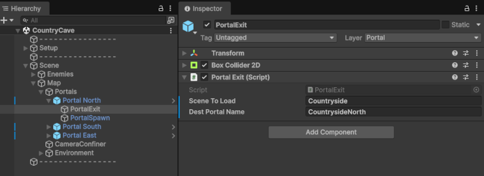
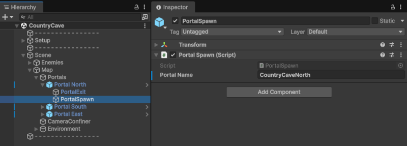

# Sistema de portales

Los portales conectan las escenas jugables, especialmente `Countryside` y `CountryCave`.

## Estructura

Cada portal contiene dos hijos:

```text
Portal
├── PortalExit
└── PortalSpawn
```

| Objeto | Función |
|---|---|
| `PortalExit` | Trigger que inicia el cambio de escena. |
| `PortalSpawn` | Punto de aparición del jugador al llegar desde otra escena. |

## PortalExit

`PortalExit` contiene un `Box Collider 2D` y el script `PortalExit`.

Campos principales:

| Campo | Función |
|---|---|
| `Scene To Load` | Nombre de la escena que se debe cargar. |
| `Dest Portal Name` | Nombre del `PortalSpawn` en la escena destino. |

Ejemplo real de `Portal North` en `CountryCave` que da acceso a `CountrysideNorth`en `Countryside`:

```text
Scene To Load: Countryside
Dest Portal Name: CountrysideNorth
```



## PortalSpawn

`PortalSpawn` identifica el punto de llegada dentro de la escena actual.

Ejemplo real en `Portal North` de `CountryCave`:

```text
Portal Name: CountryCaveNorth
```



Esto significa que ese spawn se usa para colocar al jugador cuando otro portal carga `CountryCave` y se estableció el destino `CountryCaveNorth`.

## Flujo de transición

1. Lancelot entra en el `PortalExit`.
2. Se deshabilita el mapa de input del jugador.
3. Se oculta temporalmente el sprite del jugador.
4. Se guarda el `Dest Portal Name` en `SceneManagement`.
5. Se ejecuta el fade a negro.
6. Se carga la escena destino.
7. El `PortalSpawn` cuyo nombre coincide recoloca al jugador.
8. Se reactiva el input, el sprite, la cámara y el fade desde negro.

## Código relevante

```csharp
// PortalExit.cs
SceneManagement.Instance.SetDestPortalName(destPortalName);
UIFade.Instance.FadeToBlack();
SceneManager.LoadScene(sceneToLoad);
```

```csharp
// PortalSpawn.cs
if (SceneManagement.Instance.destPortalName == portalName)
{
    PlayerController.Instance.transform.position = transform.position;
    InputManager.Instance.Controls.Player.Enable();
    CameraManager.Instance.SetPlayerCameraFollow();
    UIFade.Instance.FadeFromBlack();
}
```
[< volver](README.md)
