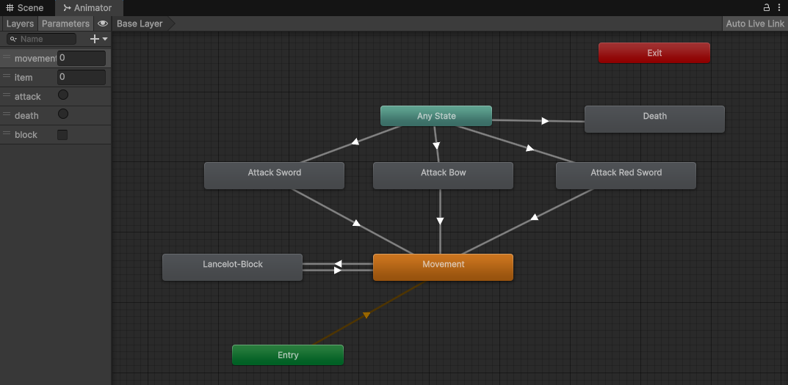
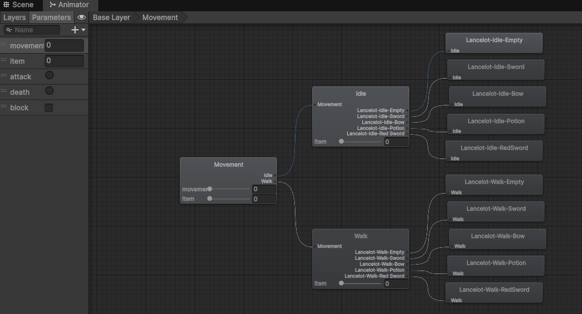
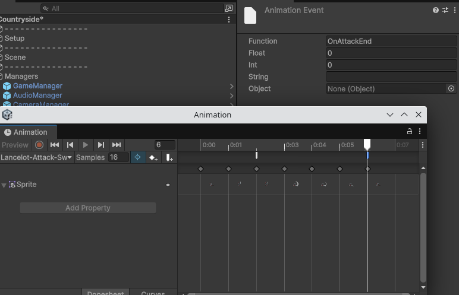

# Animaciones de Lancelot

Lancelot usa un `Animator Controller` centralizado con estados simples y varios `Blend Trees`.

## Parámetros

```text
movement
item
attack
death
block
```

## Estados principales

```text
Entry → Movement
Any State → Attack Sword
Any State → Attack Bow
Any State → Attack Red Sword
Any State → Death
Movement ↔ Lancelot-Block
Ataques → Movement
```



## Blend Trees por item

`Movement`, `Idle`, `Walk` y `Death` usan `Blend Trees` porque Lancelot cambia de sprites según el item equipado.

| Valor aproximado de `item` | Variante visual |
|---|---|
| `0` | Sin item equipado |
| `1` | Espada |
| `2` | Arco |
| `3` | Poción |
| `4` | Espada especial |



Esta solución evita duplicar el `Animator Controller` por arma. La lógica de estados se mantiene única y el parámetro `item` selecciona el set visual.

## Spritesheets de referencia

En `img/` se incluyen dos spritesheets de ejemplo:

- `lancelot_idle_sword.png`
- `lancelot_idle_bow.png`

Estos muestran la diferencia visual entre el idle con espada y el idle con arco.

## Eventos de animación

`PlayerAnimatorEvents` permite que los clips lancen eventos al código, por ejemplo para finalizar ataques o sincronizar ventanas de daño.



[< volver](README.md)