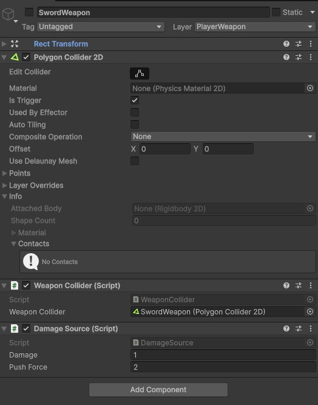
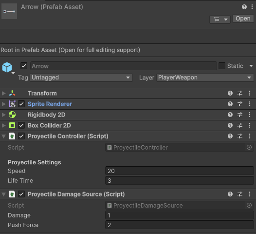
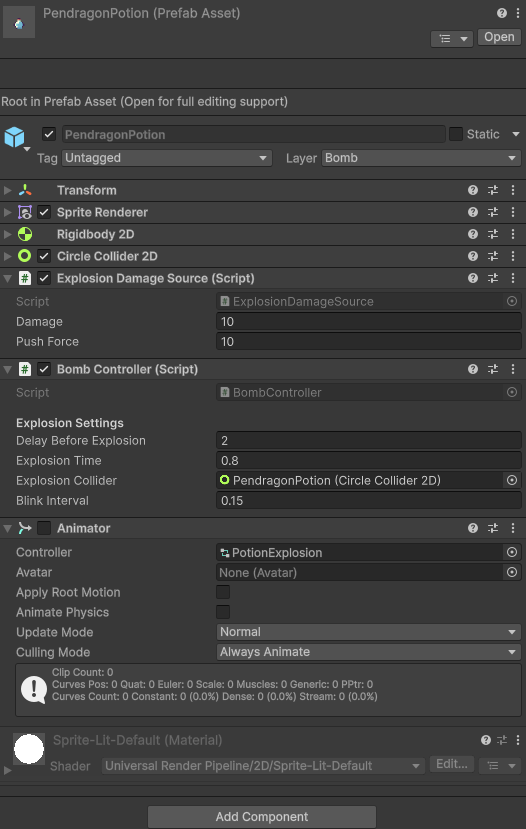

# Combate y armas

El sistema separa representación visual y comportamiento lógico.

- La representación visual del arma cuerpo a cuerpo está integrada en los sprites de Lancelot.
- La lógica del arma se define mediante prefabs hijos del jugador.
- Las armas a distancia o explosivas sí tienen sprite propio porque existen separadas en el mundo.

## Tipos de arma

| Tipo | Ejemplo | Visual propio | Comportamiento |
|---|---|---:|---|
| Cuerpo a cuerpo | `SwordWeapon` | No | Collider temporal durante ataque. |
| Proyectil | `Arrow` | Sí | Se desplaza y daña al impactar. |
| Explosivo | `PendragonPotion` | Sí | Espera, parpadea y explota en área. |

## SwordWeapon

Prefab lógico instanciado como hijo de Lancelot al equipar/obtener la espada.

| Componente | Función |
|---|---|
| `Polygon Collider 2D` | Área de impacto, `Is Trigger = true`. |
| `WeaponCollider` | Controla la ventana activa del golpe. |
| `DamageSource` | Daño y empuje. |

## Arrow

Prefab de proyectil del arco.

## PendragonPotion

Pociones explosivas.

Flujo:

1. Se instancia la pócima.
2. Espera dos segundos.
3. Parpadea como aviso.
4. Activa el área circular de explosión.
5. Daña y empuja objetivos dentro del área.

[< volver](README.md)