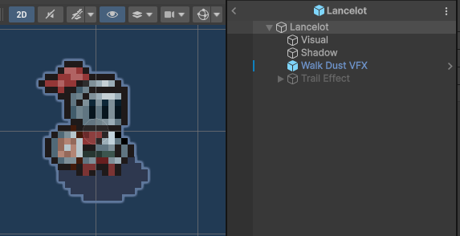

# Lancelot

`Lancelot` es el GameObject raíz del jugador. Tiene `Tag = Player` y `Layer = Player`.

## Jerarquía

```text
Lancelot
├── Visual
├── Shadow
├── Walk Dust VFX
└── Trail Effect
    └── Body
```

| Objeto | Función |
|---|---|
| `Visual` | Sprite animado, Animator y eventos de animación. |
| `Shadow` | Sombra visual bajo el personaje. |
| `Walk Dust VFX` | Partículas de polvo al caminar. |
| `Trail Effect` | Rastro visual durante el dash. |



## Componentes del objeto raíz

| Componente | Función |
|---|---|
| `Capsule Collider 2D` | Volumen físico del jugador. |
| `Rigidbody 2D` | Movimiento físico 2D. |
| `PlayerController` | Movimiento, dash, orientación, ataque, bloqueo y animación. |
| `PushBack` | Retroceso tras impactos. |
| `ActiveWeapon` | Arma equipada. |
| `PlayerCollectSubject` | Notifica recogidas a observadores. |
| `PlayerHealth` | Vida, daño, muerte y regeneración. |

## Objeto Visual


| Componente | Configuración |
|---|---|
| `Sprite Renderer` | Sprite inicial `Lancelot-Idle-Empty_0`. |
| Material | `Sprite-Lit-Default` de URP 2D. |
| `Animator` | Controller `Lancelot`. |
| `PlayerAnimatorEvents` | Eventos lanzados desde clips. |

`Apply Root Motion` está desactivado porque el movimiento lo controla el código, no las animaciones.

[< volver](README.md)