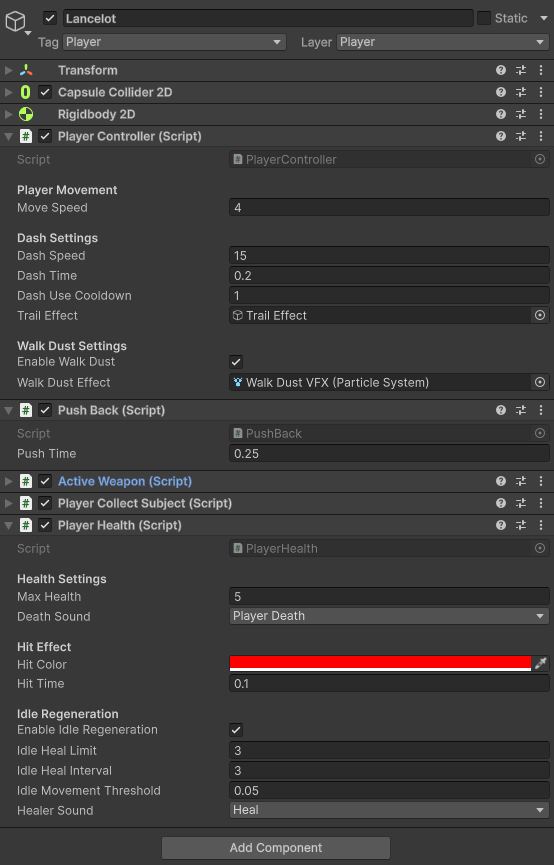

# Movimiento, dash y bloqueo

El movimiento principal se gestiona desde `PlayerController`.

## Configuración observada

| Parámetro | Valor |
|---|---:|
| `Move Speed` | `4` |
| `Dash Speed` | `15` |
| `Dash Time` | `0.2` |
| `Dash Use Cooldown` | `1` |
| `Trail Effect` | `Trail Effect` |
| `Enable Walk Dust` | `true` |
| `Walk Dust Effect` | `Walk Dust VFX` |



## Dash

El dash es una acción corta de reposicionamiento. Su velocidad alta y duración baja permiten esquivar, pero el cooldown evita el abuso.

## Bloqueo

La capacidad de bloqueo depende del arma equipada. Por ejemplo, en el `ScriptableObject` de la espada `Steel of Benwick` se indica:

```text
Can Use Shield: true
Block Move Speed Multiplier: 0.4
```

Esto permite bloquear, pero reduce la velocidad durante la defensa.

[< volver](../README.md)