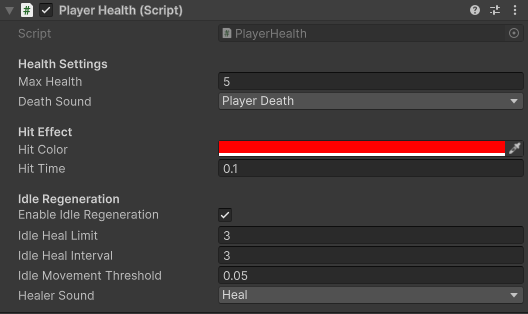

# Salud de Lancelot

`PlayerHealth` gestiona vida, daño, muerte, efecto visual de impacto y regeneración en reposo.

## Regeneración en reposo

Lancelot puede regenerarse parcialmente si permanece quieto (**`Idle Heal Interval`**). El límite de **`3`** (**`Idle Heal Limit`**) impide que recupere toda la vida sin consumir recursos o evitar daño.

[< volver](README.md)