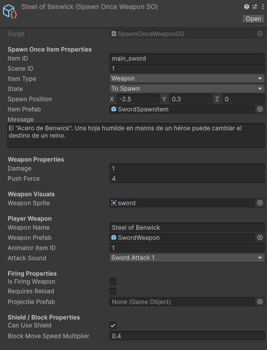
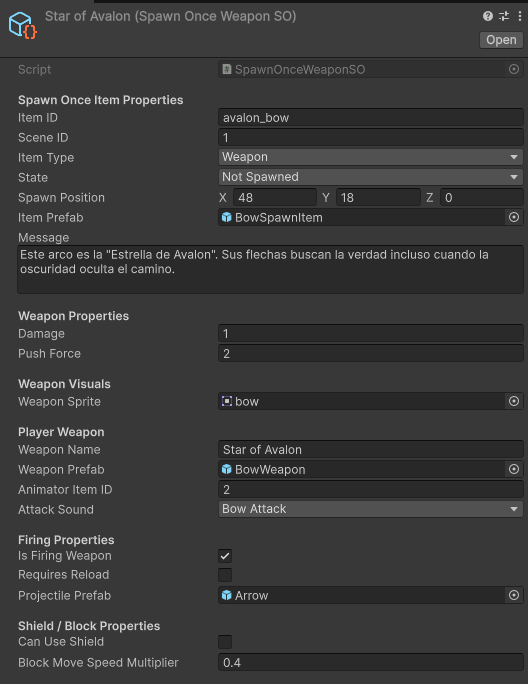
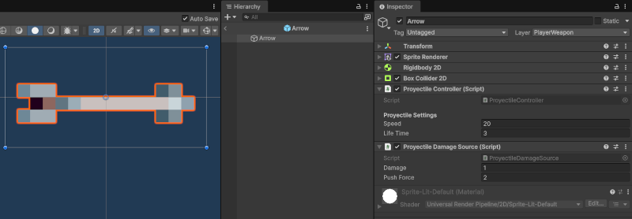
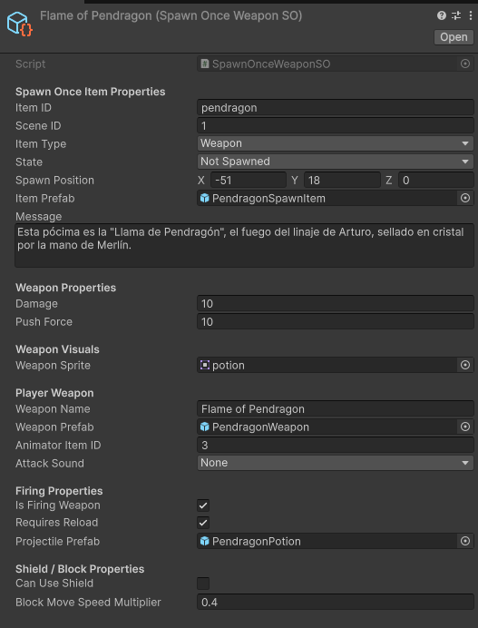
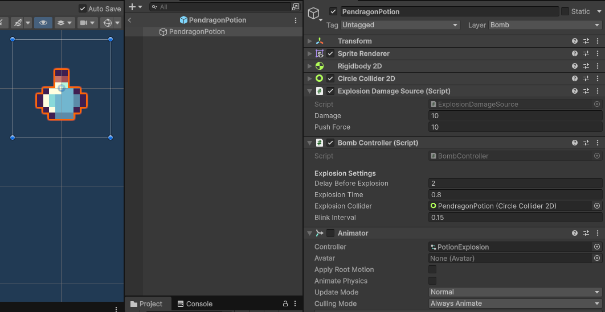

# Armas e items

Las armas e items que recibe Lancelot están definidas a partir de una jerarquía de _scriptable objects_ ([**`SpawnOnceSO`**](../../ShadowsOfCameliard/Assets/Scripts/Spawn/SpawnOnceSO.cs) y [**`SpawnOnceWeaponSO`**](../../ShadowsOfCameliard/Assets/Scripts/Spawn/SpawnOnceWeaponSO.cs)). 

En estos SO se definen las propiedades del ítem o arma así como el lugar y modo de spawn. De esta forma, al cargar la escena, el **`SceneManager`** obtiene del **`ResourcesManger`** los recursos de la misma y los instancia o no en basae a sichos parámetros.

## Steel of Benwick

Espada inicial de Lancelot. Se obtiene al comienzo para enseñar inventario y equipamiento.

Se genera a partir del _Scriptable Object_ **`SpawnOnceWeaponSO`**.

## Star of Avalon

Arco que recibe Lancelot del Capitán de la Guardia. En este caso, se establece que dicha arma dispara proyctiles (prefab `Arrow`).

Se genera a partir del _Scriptable Object_ **`SpawnOnceWeaponSO`**.

Como se aprecia en la imagen, el arco tiene activada la opción **`Is Firing Weapon`** indicando que se trata de un arma que dispara proyectiles.

### Flecha

Al disparar, el arco instancia flechas definidas por el prefab `Arrow`.

## Flame of Pendragon

Como en el caso del arco, la poción **`Llama de Pendragón`** instancia proyectiles, en este caso, los recipientes con la pócima.

### Pócima

Las pócimas instanciadas están definidas en el prefab correspondiente

[< volver](../README.md)