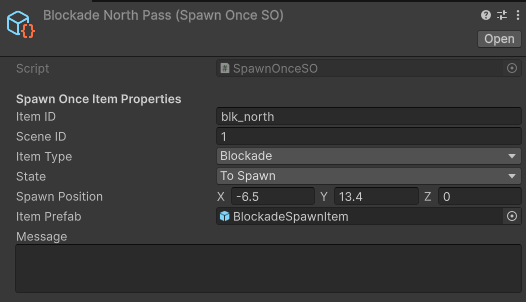
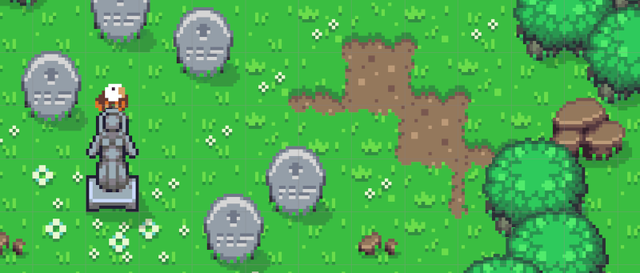

# Bloqueos, bombas y árbol mágico

## Bloqueos persistentes

El sistema de recursos nos permite definir elementos que se instanciarán en la cualquier escena y controlar su reaparición cuando se recargue la misma.

Los bloqueos se tratan como recursos persistentes para que, una vez destruidos o desbloqueados, no reaparezcan al volver a la escena (un ejemplo son las rocas que bloquean determinados puentes). 

En el momento de su destrucción, se modificará su estado a **`Destroyed`** y ya dejará de nstanciarse al entrar de nueo en la escena.

Ejemplo: `Blockade North Pass`.

## Poción de Pendragón

La bomba permite destruir enemigos o bloqueos especiales mediante daño de área. Su configuración se documenta en [Armas e items](armas-e-items.md).

## Magic Tree y Eagle

En `Countryside`, `Magic Tree` funciona como paso especial hacia Merlín y `Eagle` actúa como trigger asociado. Este sistema introduce un desbloqueo ambiental más narrativo que puramente mecánico.

[< volve](README.md)