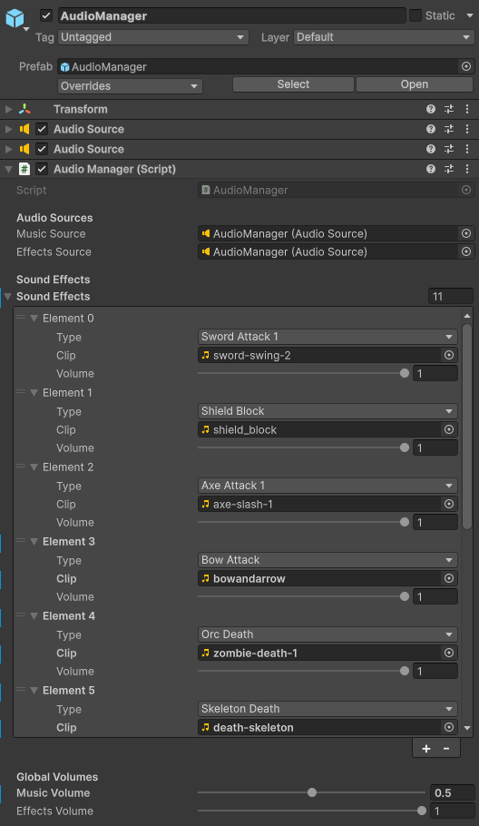

# AudioManager

`AudioManager` centraliza la reproducción de música y efectos. Hereda de `PersistentSingleton<AudioManager>` para sobrevivir a cambios de escena.

## Estructura

El prefab contiene dos `AudioSource`:

| Fuente | Uso |
|---|---|
| `Music Source` | Música de fondo en bucle. |
| `Effects Source` | Efectos puntuales mediante `PlayOneShot`. |

## Efectos configurados

El script define un enum `Effect` con sonidos como:

```csharp
public enum Effect
{
    None,
    SwordAttack1,
    SwordAttack2,
    SwordAttack3,
    ShieldBlock,
    AxeAttack1,
    AxeAttack2,
    BowAttack,
    OrcDeath,
    SkeletonDeath,
    PlayerDeath,
    ItemCollect,
    Explosion,
    Heal
}
```

En Inspector se asocia cada tipo a un `AudioClip` y a un volumen individual.



## Métodos relevantes

```csharp
public void PlayEffect(Effect soundType)
{
    SoundEntry soundEntry = GetSoundEntry(soundType);
    float finalVolume = effectsVolume * soundEntry.volume;
    effectsSource.PlayOneShot(soundEntry.clip, finalVolume);
}
```

```csharp
public void PlayMusic(AudioClip musicClip, bool restartIfSameClip = false)
{
    musicSource.clip = musicClip;
    musicSource.volume = musicVolume;
    musicSource.loop = true;
    musicSource.Play();
}
```

También existe `StopMusicWithFade(float fadeDuration)`, útil para muerte del jugador o cambios de escena.

[< volver](README.md)