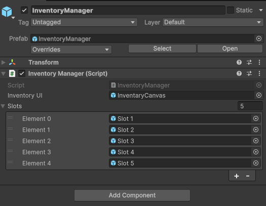
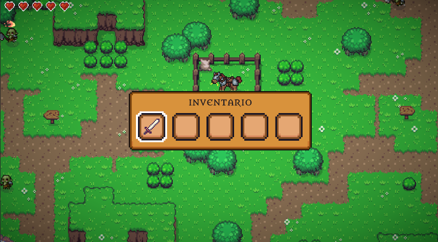

# InventoryManager

`InventoryManager` gestiona el inventario del jugador. En la demo actual usa cinco slots fijos, suficientes para los objetos clave.

## Configuración en Inspector



## Responsabilidades

- Mostrar y ocultar el canvas de inventario.
- Pausar el juego con `Time.timeScale = 0` mientras está abierto.
- Cambiar al mapa de input `Inventory`.
- Recibir notificaciones de `PlayerCollectSubject`.
- Añadir armas recogidas a los slots.
- Equipar el arma seleccionada mediante `ActiveWeapon`.

## Código relevante

```csharp
public void AddItem(string itemID, Sprite itemImage)
{
    if (!items.Contains(itemID))
    {
        items.Add(itemID);
        int index = items.Count - 1;
        GameObject slotImage = slots[index].transform.Find("ItemImage").gameObject;
        slotImage.GetComponent<Image>().sprite = itemImage;
        slotImage.SetActive(true);
    }
}
```

```csharp
void CloseInventory()
{
    if (currentMarkedSlot != selectedItemIndex)
    {
        selectedItemIndex = currentMarkedSlot;
        ActiveWeapon activeWeapon = PlayerController.Instance.GetComponent<ActiveWeapon>();
        activeWeapon.SetActiveWeapon(items[selectedItemIndex]);
    }

    ToggleInventory();
}
```

## Inventario en gameplay



[< volver](README.md)
