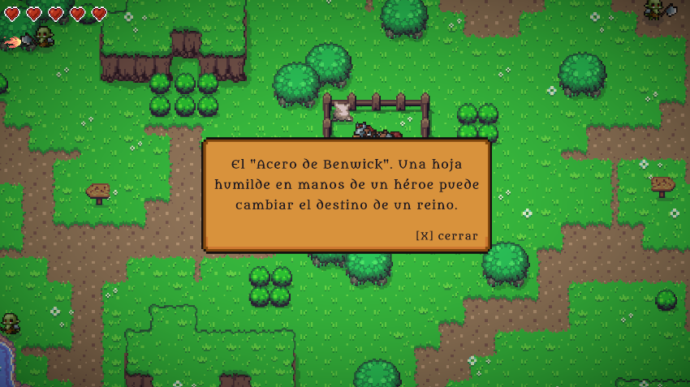

# MessageManager

`MessageManager` muestra mensajes contextuales durante la partida. Se usa para objetos recogidos, señales, diálogos breves y avisos narrativos.

## Presentación

Los mensajes aparecen como un panel centrado sobre la escena. Incluyen texto y la indicación:

```text
[X] Cerrar
```

Ejemplo al recoger la espada inicial:



## Uso de diseño

Los mensajes no solo explican mecánicas. También refuerzan el tono artúrico de la demo y dan identidad narrativa a los objetos.

[< volver](README.md)
