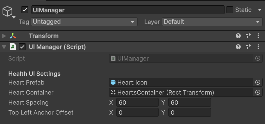

# UIManager

`UIManager` gestiona el HUD principal de gameplay, especialmente los corazones de vida y el contenedor del dash.

## Jerarquía

```text
UI
└── UIManager
    └── Canvas
        ├── HeartsContainer
        └── DashContainer
            └── Dash icon
```

## Configuración en Inspector



## Responsabilidad

`UIManager` no controla toda la UI. El inventario y los mensajes están separados en `InventoryManager` y `MessageManager`.

Esto mantiene el HUD desacoplado de ventanas contextuales y reduce el tamaño de cada manager.

[< volver](README.md)